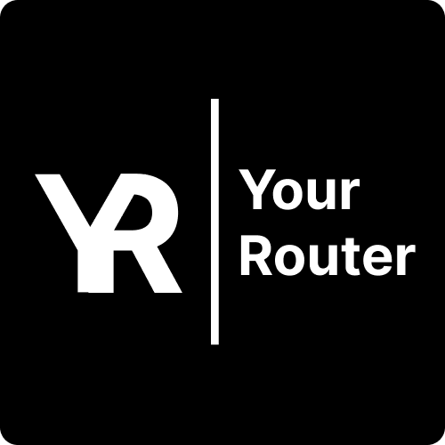

# yourRouter

A powerful router based on client-side routing

## Features

- Support for dynamic routes
- Doesn't reload the page
- Full typescript support

## Documentation

- [Documentation repo](https://github.com/ch3ber/yourRouter-docs)

- [Documentation website](https://ch3ber.github.io/yourRouter)

- [Contribution guideline](./CONTRIBUTING.md)


## Installation

Install my-project with npm

```bash
  npm i yourRouter
```

## Technologies
- Typescript  
